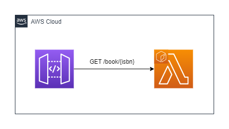

# Spring Boot をAWS Lambda で動かす

## TL;DR

AWS Lambda Web Adapter を使用すると, Dockerfile に1行追加するだけで, WEB フレームワークをAWS Lambda に乗せることができる.

```dockerfile
COPY --from=public.ecr.aws/awsguru/aws-lambda-adapter:0.7.0 /lambda-adapter /opt/extensions/lambda-adapter
```


## 構成

APIGW + Lambda (Lambda はカスタムランタイム)




## デプロイ方法

cdk 環境の構築が面倒な場合は以下. (ただし10分ほどかかる)

```sh
sudo docker run --rm -it -v {YOUR_LOCAL_AWS_DIR_HERE}:/home/mde-user/.aws -v $(pwd):/app -e AWS_PROFILE={YOUR__PROFILE_HERE} --privileged public.ecr.aws/aws-mde/universal-image:1.0 sh /app/deploy.sh
```

例 (wsl2 から動かす場合)

```sh
sudo docker run --rm -it -v /mnt/c/Users/xxx/.aws:/home/mde-user/.aws -v $(pwd):/app -e AWS_PROFILE=test --privileged public.ecr.aws/aws-mde/universal-image:1.0 sh /app/deploy.sh
```

素直にcdk deploy してもOK

※ cdk.json のapp の指定は`python3.10 app.py` となっているので注意すること


## 実行例

```sh
$ curl -X GET https://qfb1v6yaud.execute-api.ap-northeast-1.amazonaws.com/prod/book/978-4-8002-1747-9
{"isbn":"978-4-8002-1747-9","name":"響け！ユーフォニアム 北宇治高校吹奏楽へようこそ"}
```


## 参考

- [AWS Lambda の上でいろんなWEB フレームワークを動かそう！](https://speakerdeck.com/_kensh/web-frameworks-on-lambda)
- [Lambda Web Adapter でウェブアプリを (ほぼ) そのままサーバーレス化する](https://aws.amazon.com/jp/builders-flash/202301/lambda-web-adapter/?awsf.filter-name=*all)
- [SpringBoot sample](https://github.com/awslabs/aws-lambda-web-adapter/tree/main/examples/springboot)